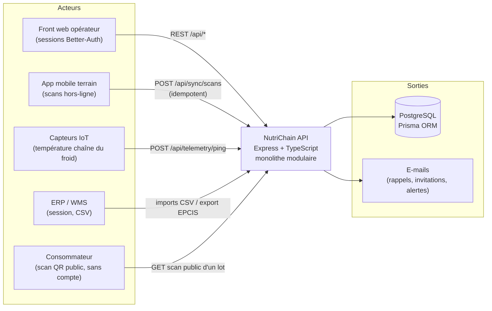
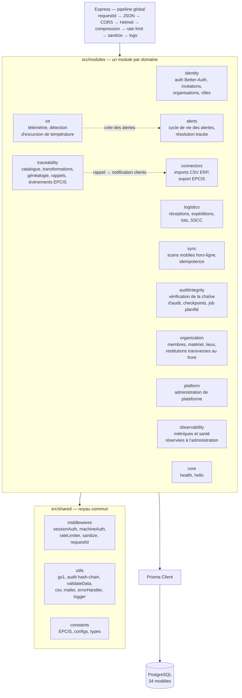
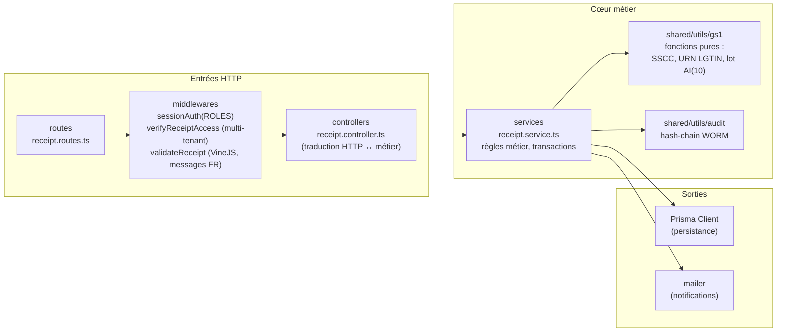
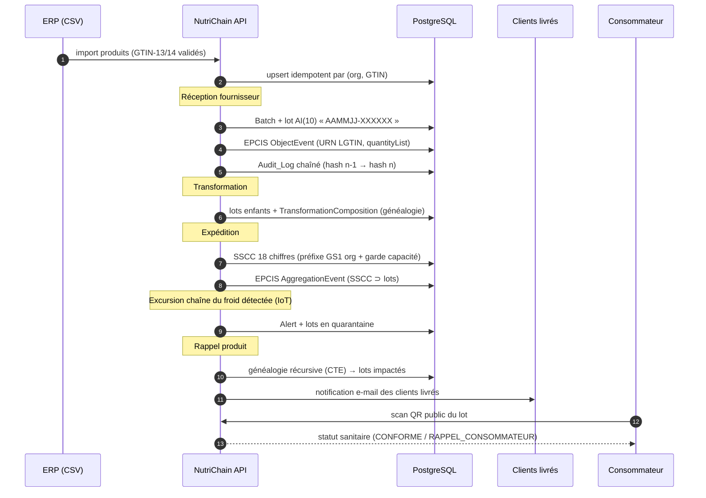
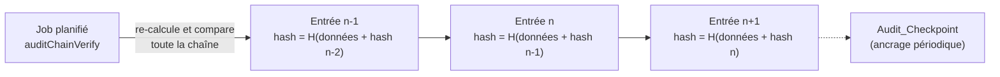

# 19 — Architecture de NutriChain API

> Document de référence sur l'architecture. Tous les schémas reflètent le code réel
> (`src/app.ts`, `src/modules/`, `src/shared/`, `prisma/schema.prisma`), revérifiés le 03/08/2026.

## 1. Vue de contexte — qui parle à l'API ?

L'API est le point central d'un écosystème de traçabilité agroalimentaire : elle sert
des humains (opérateurs, consommateurs), des machines (capteurs, ERP) et une application
mobile capable de travailler hors-ligne.

Points clés :

- **Quatre voies d'entrée, disjointes** : session Better-Auth (humains), clé API applicative
  (`x-api-key` — elle identifie une application, elle n'autorise personne, et ne remplace jamais
  une session), authentification machine par passerelle IoT (`machineAuth`, une seule route),
  et admin de plateforme. Le middleware `mixedAuth`, qui basculait en « mode machine » sur la
  seule présence d'un en-tête, **a été supprimé** : il permettait d'agir sans session.
- **Une route volontairement publique** : le scan consommateur d'un lot expédié
  (transparence sanitaire), qui n'expose que des données non sensibles.
- **PostgreSQL porte tout l'état métier** : pas de cache externe ni de broker, la cohérence repose
  sur les transactions Prisma. **Une seconde base existe pourtant** : MongoDB stocke la télémétrie
  brute des capteurs (série temporelle, purge automatique à 1 an). Elle est **obligatoire au
  démarrage** — `server.ts` bloque tant que la connexion n'est pas établie, et `MONGO_URI` fait
  partie des variables exigées au boot.

## 2. Vue modulith — les modules métier

Le projet est un **monolithe modulaire** : un seul déployable, mais des frontières
de modules strictes calquées sur les domaines métier. Chaque module possède ses
routes, middlewares, contrôleurs et services ; le partage passe exclusivement par
`src/shared/` (noyau commun) — jamais d'import direct entre entrailles de modules.

Pourquoi ce choix plutôt que des microservices :

- **Cohérence transactionnelle** : une réception crée en une seule transaction
  (`retryableTransaction`) le lot, le mouvement de stock, l'événement EPCIS et l'entrée d'audit. En
  microservices, cela exigerait des sagas — complexité injustifiée à cette échelle (YAGNI).
- **Frontières prêtes pour l'extraction** : chaque module étant autonome (routes →
  services), un module peut devenir un service séparé si la charge l'exige un jour.
- **Un seul pipeline de sécurité** : auth, rate limiting, sanitisation et audit
  sont appliqués uniformément.

## 3. Anatomie d'un module

Chaque module suit le même patron **en couches** : routes → contrôleur → service, le service
portant toute la logique métier. Le cœur métier ne connaît **ni Express ni le transport HTTP** —
aucun service n'importe Express, et c'est la propriété qui compte à la relecture.

En revanche, ce n'est **pas** une architecture hexagonale : il n'y a ni port, ni adaptateur, ni
couche Repository. Les services appellent le client Prisma directement et manipulent les types
générés. C'est un choix assumé — l'inversion de dépendance n'apporterait ici qu'une indirection
supplémentaire sur un client déjà typé. Exemple réel : `logistics/receipts`.

Conséquences concrètes :

- **Testabilité** : les services se testent avec un Prisma mocké, les utilitaires GS1
  sont des fonctions pures testées sans aucun mock (1 386 tests, 156 fichiers). Les tests
  d'intégration (`*.integration.test.ts`, 9 fichiers) sont **exclus de `npm test`** : ils exigent
  une base réelle et ne tournent que dans le job E2E de la CI.
- **Validation aux frontières** : VineJS (messages français centralisés) valide toute
  entrée *avant* le contrôleur ; le cœur métier reçoit des données déjà typées
  (`Infer<typeof schema>`, zéro `any`).
- **Multi-tenancy garanti en profondeur** : les gardes d'accès (middlewares) filtrent
  par `activeOrganizationId`, et chaque requête Prisma des services refiltre par
  `organization_id` — défense en profondeur, jamais une seule barrière.

## 4. Flux de traçabilité bout en bout (EPCIS / GS1)

Le scénario métier central : suivre un produit de la réception au consommateur,
avec identifiants GS1 stricts et rappel ciblé par généalogie.

Standards appliqués :

| Standard | Implémentation |
|---|---|
| GTIN-13/14 | validé à l'import (`/^\d{13,14}$/`), porté par `Product.code_gtin` |
| Lot AI(10) | ≤ 20 caractères, format `AAMMJJ-XXXXXX`, unique par organisation |
| SSCC | 18 chiffres, check digit modulo 10, préfixe entreprise de l'organisation |
| URN EPC | `urn:epc:class:lgtin:...` et `urn:epc:id:sscc:...` (sans check digit, règle GS1) |
| EPCIS | ObjectEvent, TransformationEvent, AggregationEvent persistés et exportables CSV |

## 5. Chaîne d'audit WORM (hash-chain)

Chaque action sensible écrit une entrée `Audit_Log` **dans la même transaction** que
l'action. Les entrées sont chaînées par hachage : falsifier une ligne casse toutes
les suivantes.

- **WORM** (Write Once, Read Many) : aucune route de modification ou suppression
  n'existe sur `Audit_Log`.
- Le module `auditIntegrity` expose la vérification à la demande et l'exécute
  périodiquement ; toute rupture de chaîne lève une alerte.

## 6. Multi-tenancy

Toutes les données métier portent un `organization_id`. Le modèle est **partagé
par schéma** (une base, filtrage par organisation) :

1. Better-Auth fournit `activeOrganizationId` dans la session.
2. Les gardes de module (`verifyBatchAccess`, `verifyReceiptAccess`,
   `verifyAlertAccess`, …) rejettent en 403/404 tout accès hors organisation.
3. Chaque requête Prisma des services inclut `organization_id` dans son `where` —
   même si la garde a déjà filtré (défense en profondeur).
4. Les imports/exports connecteurs sont cloisonnés **par la session**, comme le reste du métier :
   leurs routes portent `sessionAuth(ADMIN_ROLES)` en écriture et `sessionAuth(ALL_ROLES)` en
   lecture. Ils ne s'appuient sur aucune clé API.

## 7. Décisions structurantes (résumé)

| Décision | Motivation |
|---|---|
| Monolithe modulaire, pas de microservices | Transactions ACID sur les flux critiques ; équipe réduite (un seul déployable à opérer) ; frontières extractibles plus tard |
| Découpage en couches par module (pas d'hexagonal) | Cœur métier testable sans HTTP ; 1 386 tests rapides, 90,58 % de couverture de lignes |
| Prisma + migrations versionnées | Schéma tracé en Git, reproductible (fini `db push`) |
| Sessions Better-Auth pour les humains, `machineAuth` pour les capteurs | Chaque voie porte sa propre identité et son organisation ; la clé API n'autorise rien à elle seule |
| VineJS aux frontières, messages FR | Erreurs exploitables par le front, cœur métier typé strict (zéro `any`) |
| Audit hash-chain en transaction | Preuve d'intégrité opposable, sans infrastructure dédiée |
| GS1/EPCIS natifs (pas de plugin) | Maîtrise fine des règles (URN sans check digit, AI(10) ≤ 20 car.) |
